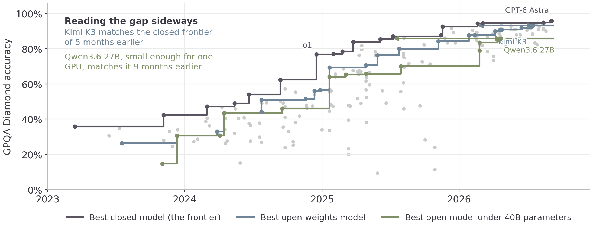
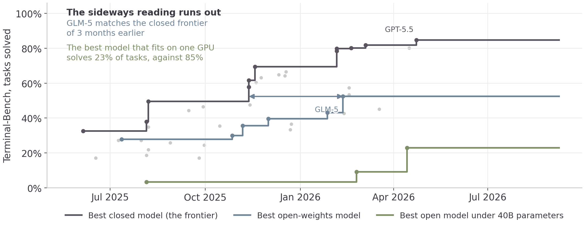
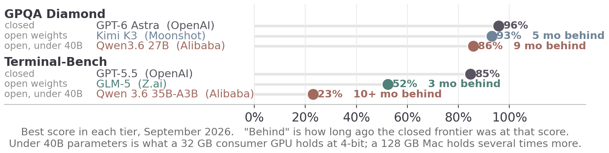

## This afternoon

::: {.cards .cards-2}
::: {.card}
[Retrieval augmented generation]{.card-title}

Answering from your own documents, with a citation you can open.
:::

::: {.card .card-blue}
[Open source models]{.card-title}

What you can download and run yourself, and how far behind it is.
:::
:::

# 15 · Retrieval augmented generation

Answering from your own documents, with a citation you can open.

## Structured and unstructured {.compare}

:::: {.columns}
::: {.column width="50%"}
[Yesterday]{.eyebrow}

Rows, columns, joins. Five spreadsheets and a total you could reconcile.
:::

::: {.column width="50%"}
[Everything else a firm holds]{.eyebrow}

Contracts, mail, board papers, policies, reports, decks, notes.
:::
::::

::: {.note}
65% of data leaders call their structured data ready for AI. 39% say the same of the unstructured kind, which is most of the volume.
:::

## Why not just paste it in

::: {.cards .cards-3}
::: {.card}
[It was not trained on yours]{.card-title}

Your contracts were not on the public web. Nothing in the weights knows them.
:::

::: {.card .card-blue}
[The window is finite]{.card-title}

A million tokens is large and your document store is larger.
:::

::: {.card}
[You pay for every turn]{.card-title}

Input is billed each turn. Pasting the corpus into every question bills the corpus every question.
:::
:::

## Four steps {.plain-title}

::: {.steps}
1. Chunk. Split the documents into passages of a few hundred words.
2. Embed. Turn each passage into a vector, the same way tokens became vectors on Thursday.
3. Retrieve. Embed the question and find the handful of passages closest to it.
4. Paste. Put those passages in the prompt, with the question.
:::

::: {.note .note-plum}
The model never reads your corpus. It reads an excerpt that a similarity search chose.
:::

## A passage becomes 384 numbers

::: {.lead}
An embedding model reads a passage and returns a fixed-length list of numbers — 384, or 768, or 1,536, depending on the model.
:::

Passages about the same thing land near each other, whatever words they used. "Revenue fell in the third quarter" sits close to "Q3 sales were down", and a keyword search for "revenue" finds only the first.

## Chunking choices {.plain-title}

| Choice | What it costs |
|---|---|
| Chunks too small | the passage arrives without the sentence that made it mean something |
| Chunks too large | the relevant line arrives inside a page of text you paid for |
| Split mid-table | numbers arrive with no column headings |
| No overlap | an answer spanning a boundary is never retrieved whole |

Split on the document's own structure — sections, clauses, slides — before falling back on a word count.

## Two ways to have one {.compare}

:::: {.columns}
::: {.column width="50%"}
[A hosted tool]{.eyebrow}

Upload the folder, ask questions. Somebody else chose the chunking, the embedder and the number of passages retrieved.
:::

::: {.column width="50%"}
[A pipeline you own]{.eyebrow}

Your chunking rules, your embedder, your store, and the retrieved text visible before it reaches the model.
:::
::::

Start hosted. Build your own when the answers are wrong and you need to see which passages came back.

## Build one over your own documents {.plain-title}

[Exercise]{.eyebrow}

::: {.steps}
1. Put twenty or more of your own documents in a folder — reports, policies, decks, anything real but not confidential.
2. Have them chunked and embedded into a local store, and have the chunking rule stated in writing.
3. Add a search tool to an agent, so it retrieves before it answers.
4. Ask five questions you already know the answers to.
5. Make it print the passages it retrieved, not just the answer.
:::

::: {.note}
An answer you cannot trace back to a passage is not verifiable.
:::

## Make it cite, then check the citation

::: {.lead}
Open each passage it cites and check that the answer is in it.
:::

::: {.steps}
1. Ask a question whose answer is in exactly one document.
2. Ask one whose answer is spread over three.
3. Ask one whose answer is in none of them, and see whether it says so.
:::

::: {.note}
A retriever always returns its closest matches, whether or not any of them are relevant.
:::

## Permissions and chunking {.compare}

:::: {.columns}
::: {.column width="50%"}
[The document]{.eyebrow}

Sat in a folder with an access list. Three people could open it.
:::

::: {.column width="50%"}
[The chunk in the store]{.eyebrow}

Is a row in a database with a vector next to it. Usually carries no access list at all.
:::
::::

Index everything and the retriever will return a passage from a file the person asking could never have opened.

## Retrieved text is untrusted text {.plain-title}

Anything that reaches the model reaches it as text, and text from a retrieved passage arrives in the same stream as your question. Whoever can put a document into the index can put instructions in front of the model.

::: {.note}
The Sunday morning question: who can write to the corpus, and what can the agent do once it has read one.
:::

## When it is the wrong tool

::: {.cards .cards-3}
::: {.card}
[Few enough to paste]{.card-title}

Twenty pages fit in the window. Retrieval adds a failure mode and buys nothing.
:::

::: {.card .card-blue}
[The answer is a number]{.card-title}

Totals, counts and rankings come from a query against the data, not a similarity search over prose.
:::

::: {.card}
[The corpus changes hourly]{.card-title}

Every change means re-embedding, and the index is out of date between rebuilds.
:::
:::

## Break your own {.plain-title}

[Exercise]{.eyebrow}

::: {.steps}
1. Add a document to your index that contradicts another one. Ask the question both answer.
2. Add one containing an instruction addressed to the agent. Ask an unrelated question.
3. Ask something answered only by a table you chunked in the middle.
4. Write down which of the three your setup handled, and what you would change.
:::

## Screen shares {.band-bottom}

- What you indexed, and how you chunked it
- One question it answered well, with the passage it used
- The one that broke it

# 16 · Open source models

## What GPQA Diamond measures {.plain-title}

::: {.lead}
Four-way multiple-choice questions in biology, physics and chemistry, written by people who hold or are working toward a PhD in the field they wrote for.
:::

::: {.stats}
::: {.stat}
[25%]{.stat-value}
[guessing]{.stat-label}
:::
::: {.stat}
[34%]{.stat-value}
[skilled non-experts, 30+ minutes of open web search]{.stat-label}
:::
::: {.stat}
[74%]{.stat-value}
[PhDs answering inside their own field]{.stat-label}
:::
:::

::: {.note}
Diamond is the hardest 198 of the 448 questions: both expert annotators answered correctly and most non-experts did not. Rein et al., 2023.
:::

## How far behind is it? {.plain-title}

{width=76%}

::: {.note}
Each line is that tier's best score so far; gray dots are every other model. Source: Epoch AI, 8 Sep 2026.
:::

## What Terminal-Bench measures {.plain-title}

::: {.lead}
An agent is given a container, a plain-English objective, and a terminal. It has to do the job: compile the code, train the model, configure the server, find the bug.
:::

::: {.stats}
::: {.stat}
[7]{.stat-value}
[task domains: software, ML, science, operations, security, hardware, media]{.stat-label}
:::
::: {.stat}
[4]{.stat-value}
[parts to a task: instruction, container, test suite, reference solution]{.stat-label}
:::
::: {.stat}
[0 or 1]{.stat-value}
[per task — the tests pass or they do not]{.stat-label}
:::
:::

::: {.note}
Built by the Laude Institute with Stanford researchers. No human baseline is published. The version charted here dates from mid-2025; a harder v4.0 has since cut the frontier to about 60%.
:::

## The same three tiers, on agentic work {.plain-title}

{width=80%}

::: {.note}
Epoch's mirror of Terminal-Bench; its closed-model coverage runs to April 2026.
:::

## Where each tier stands today {.plain-title}

{width=99%}

## Two numbers, two different answers {.compare}

:::: {.columns}
::: {.column width="50%"}
[The months]{.eyebrow}

Three to five months, on both benchmarks. A model small enough for one consumer GPU is nine to ten months back, on both.
:::

::: {.column width="50%"}
[The scores]{.eyebrow}

On graduate science questions the open gap is 3 points. On agentic terminal work it is 33, and the small model solves 23% against the frontier's 85%.
:::
::::

GPQA Diamond is near its ceiling, which compresses the gap: five months of lag is worth three points because there is nowhere left to go. Terminal-Bench is not near any ceiling, and there the same few months is most of the task.

## What that means for a choice {.band-bottom}

::: {.cards .cards-3}
::: {.card}
[Answer from knowledge]{.card-title}

A 27B open model scores 86% on GPQA Diamond against the frontier's 96%, on hardware you own.
:::

::: {.card .card-blue}
[Reason over your documents]{.card-title}

A large open model is a few months behind and self-hostable. Test it on your own task before taking the ranking.
:::

::: {.card .card-sand}
[Run a multi-step agent]{.card-title}

On Terminal-Bench the best open model solves 52% and the best small one 23%, against the frontier's 85%.
:::
:::

## Not every job needs the largest model

| | Where it runs | What it suits |
|---|---|---|
| A frontier model | the provider's API | judgment, long context, code |
| A mid-size model | the same API, less per token | classification, extraction, routing |
| A small open model | your own hardware | high volume, or data that cannot leave |
| A fine-tuned small model | your own hardware | one narrow task, done constantly |

The price difference is negligible on a single question and decides the budget at a million classifications.

## Distillation, in one paragraph

::: {.lead}
Run the frontier model on a few thousand examples of your task. Keep the inputs and its outputs. Train a small model on those pairs.
:::

The small model does not become generally capable. It becomes capable at the one task you sampled, at a fraction of the cost per call, on hardware you control.

## Tomorrow {.band-bottom}

The API underneath the tools, an agent with a tool list you chose, and managing security risks.
