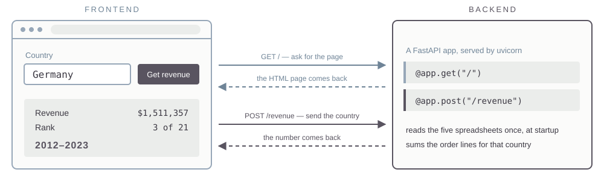

## This morning

::: {.lead}
Yesterday's output was a number. This morning it becomes a file or an app somebody else opens.
:::

::: {.cards .cards-2}
::: {.card}
[Creating docs]{.card-title}

Excel, Word and PowerPoint out of the machine — including into the template your firm already uses.
:::

::: {.card .card-blue}
[Creating apps]{.card-title}

How a web app works, then build one and deploy it.
:::
:::

# 13 · Creating docs

## Office files are archives

::: {.lead}
A `.docx`, `.xlsx` or `.pptx` is a ZIP file containing XML.
:::

Unzip one and the document's structure, styles and data are readable as text. That is why an agent can edit an existing file in place — keeping its template, its headers and its formatting — instead of rebuilding it.

::: {.note}
So "edit the deck the firm already uses" opens the existing file, while "build me a deck like ours" starts from nothing.
:::

## Excel that is a model, not a table {.compare}

:::: {.columns}
::: {.column width="50%"}
[A table]{.eyebrow}

Values pasted into cells. Change an assumption and the analysis is rerun somewhere else, by you.
:::

::: {.column width="50%"}
[A model]{.eyebrow}

Inputs in labelled cells, formulas referencing them, a chart bound to the range. Change an assumption in the sheet and everything moves.
:::
::::

Ask for formulas rather than values, and name the input cells.

## What the recipient opens

| Recipient | Format | What it has to carry |
|---|---|---|
| An analyst who will extend it | `.xlsx` with formulas | inputs, formulas, the definition |
| A manager approving something | `.pptx` or one page | the number, the chart, the caveat |
| A job that runs every week | `.csv` plus a script | reproducibility, not formatting |
| The record | `.docx` or PDF | the method, in sentences |

## The deck already has a house style {.plain-title}

::: {.lead}
Asking for "a deck in our style" produces an imitation of the design rather than the firm's file.
:::

A `.pptx` template is not a picture of a design. It is a file holding named slide layouts, a theme with the firm's exact colours and fonts, and placeholder positions measured to the point.

::: {.note}
Open one with `unzip -l`. The layouts are in `ppt/slideLayouts/`, the palette and typefaces in `ppt/theme/theme1.xml`.
:::

## Fill the template, do not imitate it {.compare}

:::: {.columns}
::: {.column width="50%"}
[Generating a deck]{.eyebrow}

The model invents a layout. Colours are close. The logo is missing, the footer is wrong, and the title is out of position.
:::

::: {.column width="50%"}
[Filling a template]{.eyebrow}

The file is opened, a named layout is chosen, and text goes into the placeholders that layout defines. Everything else is inherited.
:::
::::

Same request, two implementations.

## A skill that knows your template {.plain-title}

::: {.steps}
1. Put the `.pptx` in the skill's folder.
2. List the layouts by name, and say in prose what each one is for.
3. Say which placeholder takes what — title, body, source line, page number.
4. State the rules a human would know: how many bullets before a slide splits, where the source line goes, what never gets edited.
:::

::: {.prompt-box}
::: {.box-title}
Prompt
:::
Read `template.pptx`. List every slide layout by name and index, and for each one the placeholders it defines with their type and position. Write that into SKILL.md as a table, then write the instructions for filling it.
:::

## Turn your own template into a skill {.plain-title}

[Exercise]{.eyebrow}

::: {.steps}
1. Upload a deck your firm actually uses. Any recent one will do.
2. Have the layouts and placeholders enumerated, and check the list against what you see in PowerPoint.
3. Write the skill, with the file in its folder.
4. Build a three-slide deck from yesterday's country analysis using it.
5. Open the result next to a real deck and find what is off.
:::

::: {.note}
Some of the firm's conventions are not in the template file at all.
:::

## Build the deliverable {.plain-title}

[Exercise]{.eyebrow}

::: {.steps}
1. Take your corrected country analysis.
2. Produce it in the format the person who would receive it actually opens.
3. Put the revenue definition and the row counts on the face of it.
4. Open the file in the file browser and look at it the way they would.
:::

::: {.note}
If you built a workbook, change one input cell and check that the chart moves.
:::

# 14 · Creating apps

Explain how it works, build three, then put one on the internet.

## When a skill is not enough {.compare}

:::: {.columns}
::: {.column width="50%"}
[A skill]{.eyebrow}

For someone who has the agent, the files, and a reason to be at a command line.
:::

::: {.column width="50%"}
[An app]{.eyebrow}

For someone with a browser and a question. No install, no terminal, no account.
:::
::::

Same job, different audience.

## Frontend and backend {.compare}

:::: {.columns}
::: {.column width="50%"}
[Frontend]{.eyebrow}

The browser. HTML, CSS and JavaScript — it draws the page and collects the clicks.
:::

::: {.column width="50%"}
[Backend]{.eyebrow}

A program on a server that listens continuously for requests. Yours will be Python.
:::
::::

::: {.lead}
You open a URL. The browser sends a GET request. The server sends back HTML, CSS and JavaScript. The browser interprets that and shows you a page.
:::

::: {.note}
Right-click any web page and choose View Page Source. That is the frontend code, exactly as the backend handed it over.
:::

## Then you click something {.plain-title}

::: {.lead}
A POST request carries data the other way — a form, a country you typed. The server does what it was written to do and replies.
:::

{.nostretch width="82%" fig-align="center"}

## Running locally {.band-bottom}

::: {.cards .cards-2}
::: {.card}
[localhost]{.card-title}

`127.0.0.1` is the loopback address. The browser asks the machine it is already running on, and the request never reaches a network.
:::

::: {.card .card-blue}
[Ports]{.card-title}

One machine runs many programs listening at once. The port number tells the operating system which of them gets the request.
:::
:::

The app is a `.py` file that imports FastAPI. uvicorn runs that file and starts it listening on a port.

## Three shapes

::: {.cards .cards-3}
::: {.card}
[One page, no server]{.card-title}

Everything runs in the browser. A single HTML file you can mail to someone.
:::

::: {.card .card-blue}
[A small server]{.card-title}

Python behind the page. Needed when there is a database, a key, or a file to write.
:::

::: {.card}
[A server that calls a model]{.card-title}

The page collects a question; the server sends it to the model with your key, not the user's.
:::
:::

## One page, no server {.plain-title}

[Exercise]{.eyebrow}

::: {.steps}
1. Build a single HTML file that does one useful calculation from your own work.
2. Open it in the browser from the file browser. No server involved.
3. Mail it to yourself and open it on your phone.
:::

::: {.note}
Nothing to deploy, nothing to pay for, and it works with no network.
:::

## A page with Python behind it {.plain-title}

[Exercise]{.eyebrow}

::: {.steps}
1. Take the country analysis. Put a dropdown of countries on a page.
2. Have the server read the spreadsheets, compute the answer for the country chosen, and return it.
3. Serve it on port 8000 and open it at your own address on the lab server.
4. Watch the terminal while you click. Every request appears there.
:::

::: {.note}
The terminal prints one line per request: the method, the path, and the status code.
:::

## Hand it to your neighbour {.plain-title}

[Exercise]{.eyebrow}

::: {.steps}
1. Give your address to the person next to you and say nothing else.
2. Watch them use it. Write down every place they hesitate.
3. Fix the one that cost them the most time.
4. Swap back and check the fix on their machine, not yours.
:::

## Deploying an app {.divider}

## Platform as a service

::: {.lead}
You hand a host your repository. It builds the app, runs it, and puts it behind a public URL. There is no server for you to administer.
:::

Railway, Render, Koyeb and Heroku all do this. We use Koyeb, which has a free tier.

::: {.steps}
1. Create a free account at `koyeb.com`.
2. In the control panel, create an API access token. Koyeb shows it once, so copy it then.
3. Add it to the `~/.env` file you made on Thursday, the same way.
:::

## What has to travel {.plain-title}

::: {.prompt-box}
::: {.box-title}
Prompt
:::
My goal is to push this app to GitHub as a new public repo and then create a Koyeb service connected to it. Walk me through it one step at a time.
:::

::: {.note .note-plum}
The host builds only what is in the repository. Data files you told git to ignore never arrive, and the app fails on the host. Nothing from `.env` belongs in a public repo — secrets go in Koyeb's environment settings instead.
:::

## Put it on the internet {.plain-title}

[Exercise]{.eyebrow}

::: {.steps}
1. Push the app from "A page with Python behind it" to a public GitHub repository.
2. Create the Koyeb service and watch the build log.
3. When it fails, read the log before asking. It is almost always a missing file or a missing key.
4. Open the public URL on your phone, off the lab wifi.
5. Send the URL to two people in the room.
:::

::: {.note}
A custom domain is optional and takes ten minutes: buy one, create an API token at the registrar, and have the DNS record written for you.
:::

## Deployment, in four lines {.band-bottom}

- What runs on your machine does not run anywhere else until you make it
- The repository is the unit of deployment, and it is not the same as your folder
- Secrets live in the host's settings, never in the code
- The build log says what went wrong, in order, every time

## This afternoon {.band-bottom}

The app you just deployed answers from what you wrote into it. This afternoon it answers from your own documents instead.
