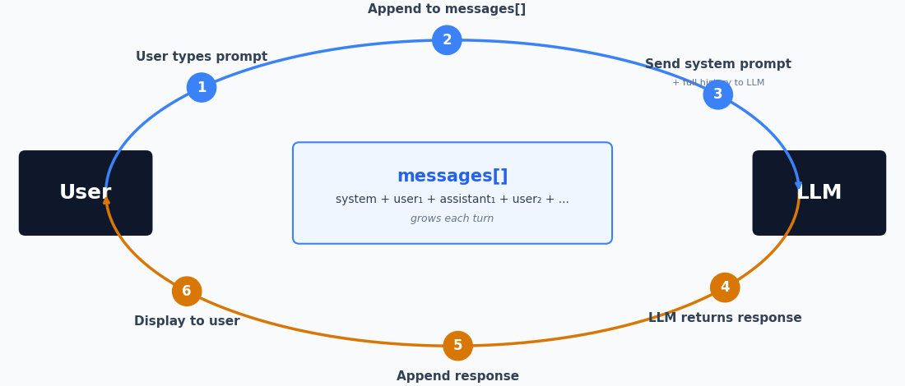
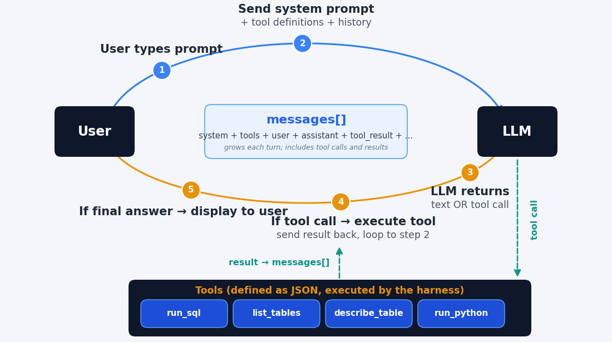

## About me

::: {.cards .cards-2}
::: {.card}
[Position]{.card-title}

J. Howard Creekmore Professor of Finance and Professor of Economics

At Rice since 2009. Before that, Northwestern, Indiana, Washington University in St. Louis, and Texas A&M
:::

::: {.card .card-blue}
[Teaching]{.card-title}

- Gen AI and Quant Investments (MBA)
- Applied Finance (MBA)
- Agentic AI, Data, and Decisions (MBA)
- Asset Pricing (PhD)
- Data-Driven Finance (MDS)
- AI and Data Management (ENGI)
- Making Data-Driven Decisions with Agentic AI (Exec Ed)
:::
:::

## Course overview {.smaller}

| Part | | Topics |
|:--|:-------------------------|:------------------------------------------------------------|
| 1 | Intro to models and agents | How LLMs work · models and performance · how agents work · computer use |
| 2 | Working with AI | Doing work with AI · prompting tips · permissions |
| 3 | Standing instructions and connectors | CLAUDE.md · how it remembers you · SKILL.md · MCP connectors · plugins |
| 4 | Building agents | How software works · API calls · build a chatbot · build an agent |
| 5 | Deploying agents | Academic Studio · running apps and agents locally · Git and GitHub · deploying apps and agents |
| 6 | Documents and local models | Retrieval augmented generation · Gemini Notebook · running models locally |
| 7 | Agent security | Multi-agent architectures · security risks · mitigating risks |

::: {.note}
Every part has hands-on blocks in your own container. Bring a laptop and stay on wifi for four days.
:::

## This session

1. How language models work
2. Models and performance
3. How agents work
4. Computer use

## A brief history {.band-bottom}

| When | What |
|----|--------------|
| 2017 | Google researchers publish the transformer ("Attention Is All You Need") |
| 2020 | GPT-3 (OpenAI) shows abilities that appear with scale |
| 2022--2023 | Online chatbots. You typed, it typed back |
| 2023--2024 | Code execution and web search arrive |
| 2025 | The serious versions move to the command line, reading and writing files on your own machine. DeepSeek R1 appears |
| 2025--2026 | That command-line capability is wrapped back into an app |
| 2026 | Agents that carry out extended work on your files without you living in a terminal |

## Andrej Karpathy: OpenAI co-founder, former Tesla AI chief, now at Anthropic {.smaller}

::: {.cards .cards-3}
::: {.card .fragment}
[October 2025]{.card-title}

"They just don't work. They don't have enough intelligence, they're not multimodal enough, they can't do computer use and all this stuff. They don't have continual learning. You can't just tell them something and they'll remember it."

"I feel like the industry is making too big of a jump and is trying to pretend like this is amazing, and it's not. It's slop."
:::

::: {.card .card-blue .fragment}
[December 2025]{.card-title}

"I really am mostly programming in English now, a bit sheepishly telling the LLM what code to write... in words. Biggest change to my basic coding workflow in ~2 decades."
:::

::: {.card .fragment}
[February 2026]{.card-title}

"It is hard to communicate how much programming has changed due to AI in the last 2 months: not gradually and over time in the 'progress as usual' way, but specifically this last December. Coding agents basically didn't work before December."

"I don't think I've typed like a line of code probably since December."
:::
:::

# 1 · How language models work

Enough of the mechanism to explain what these models are good at and where they fail. Every failure you meet over the four days has a cause in this block.

## Tokenization

Text is cut into pieces from a fixed vocabulary before the model sees any of it.

```
"The cat sat on the mat"  ->  ["The", " cat", " sat", " on", " the", " mat"]

"Unbelievable"            ->  ["Un", "believ", "able"]
```

Common words stay whole; rare and long words break into pieces. A typical vocabulary runs to about 100,000 tokens.

::: {.note}
Numbers break on the same rules, which have nothing to do with arithmetic. `13,963,378.65` reaches the model as a handful of unrelated pieces.
:::

## The whole task {.plain-title}

::: {.lead}
Given the tokens so far, predict the token that comes next. That is the entire operation.
:::

Everything a model appears to do — answering, summarizing, writing code, refusing — is that one prediction, repeated.

::: {.note}
The input can currently run to about a million tokens, roughly two-thirds of the Harry Potter saga.
:::

## Vectors

The model does not work with tokens. It works with numbers.

::: {.cards .cards-2}
::: {.card}
[Each token is a list]{.card-title}

"king" becomes 4,096 numbers. "queen" becomes 4,096 numbers that are close to them.

Tokens used in similar contexts end up near each other.
:::

::: {.card .card-blue}
[The space is mostly empty]{.card-title}

There are far more possible vectors than there are tokens, so most points in the space name nothing.

The prediction can land between tokens.
:::
:::

## A neural network is a function {.compare}

:::: {.columns}
::: {.column width="50%"}
[The idea]{.eyebrow}

$y = 4x$ is a function. The 4 is a parameter.

Change it to 3 and you have the same structure with different behavior.
:::

::: {.column width="50%"}
[The scale]{.eyebrow}

Same idea with hundreds of billions of parameters, arranged as a transformer — the architecture published by Google researchers in 2017.
:::
::::

## Training

::: {.cards .cards-2}
::: {.card}
[What is learned]{.card-title}

The vector for every token, and every parameter in the network.

Both are adjusted together to reduce prediction error on the training text.
:::

::: {.card .card-blue}
[What it takes]{.card-title}

Trillions of words. Thousands of GPUs for weeks or months. Tens to hundreds of millions of dollars for one run.
:::
:::

::: {.note}
Nothing is looked up or stored as fact. The arrangement captures how words are used, which is why it recalls common things reliably and rare things unreliably.
:::

## The pipeline {.plain-title}

::: {.steps}
1. Tokenize the input.
2. Look up the vector for each token.
3. Feed the vectors into the network.
4. The network produces one output vector.
5. Find which token vectors are closest to it.
6. Emit a token, append it to the input, and start again at step 1.
:::

## Temperature

The network does not output one token. It outputs a probability for every token in the vocabulary. Temperature controls how that distribution is sampled.

| Setting | Behavior |
|---|---|
| Near 0 | The highest-probability token every time. Repeatable. |
| Near 1 | Sampled from the distribution. Different each run. |
| Higher | Low-probability tokens get picked. Text degrades. |


## From prediction to conversation

A model trained only to predict the next token continues your text. It does not answer a question.

::: {.steps}
1. Role tokens. The text is wrapped in markers: `<|user|>` your question `<|assistant|>`.
2. Instruction tuning. The model is further trained on examples where what follows `<|assistant|>` is a useful reply.
3. Reinforcement learning from human feedback. Raters score replies, and the model is trained toward what raters preferred.
:::

The mechanism did not change. What changed is which continuation is the likely one.

## Reasoning models

The same trick applied again: train the model to write out its working before it answers.

::: {.cards .cards-2}
::: {.card}
[How it was trained]{.card-title}

Reinforcement learning on problems whose answers can be checked — mathematics, code, puzzles — rewarding the chains of tokens that arrived at a correct answer.
:::

::: {.card .card-blue}
[Why it helps]{.card-title}

The model holds no state between tokens. The intermediate tokens are the only place a partial result can live, so writing them out is the computation.
:::
:::

::: {.note}
The thinking you see may be a summary of a much longer chain, and you are charged for the whole chain as output tokens.
:::


## Demo

| Tab | What it shows | Model |
|--------|---------------|----------|
| Tokens | How text is cut into tokens | Qwen3-1.7B-Base, o200k_base |
| Token embeddings | Each token's vector, and its nearest tokens | Qwen3-1.7B-Base |
| Next token | Next-token probabilities, and temperature | Qwen3-1.7B-Base |
| Base vs chat | One prompt, to a base model and a chat model | Qwen3-1.7B-Base, Qwen3-1.7B |


::: {.note}
Everything runs on my laptop. o200k_base is OpenAI's tokenizer; the rest are open-weight models from Hugging Face.
:::

# 2 · Models and performance

Who makes the frontier models, what they cost, and how they are compared. Prices and scores are as of September 18, 2026.

## The frontier: closed weights

| Provider | Model | Released | Input / output, $ per M tokens |
|----|-----|----|----------|
| Anthropic | Claude Fable 5.1 | Sep 2026 | 10 / 50 |
| Anthropic | Claude Opus 5 | Jul 2026 | 5 / 25 |
| Anthropic | Claude Sonnet 5 | Jun 2026 | 2 / 10 |
| OpenAI | GPT-6 Astra | Sep 2026 | 10 / 50 |
| OpenAI | GPT-5.6 Sol | Jul 2026 | 5 / 30 (4 / 20 until Nov 21) |
| Google | Gemini 3.8 Flash | Sep 2026 | 1.50 / 7.50 (0.75 / 3.75 until Dec 31) |
| xAI | Grok 4.6 | Aug 2026 | 2 / 6 |
| Meta | Muse Spark 1.3 | Sep 2026 | 1.25 / 4.25 |

## The frontier: open weights

| Provider | Model | Released | Input / output, $ per M tokens |
|---|---|---|---|
| Alibaba | Qwen3.8-Max | Aug 2026 | 2 / 6 |
| Zhipu (Z.ai) | GLM-5.3 | Aug 2026 | 1.40 / 4.40 |
| Moonshot | Kimi K3 | Jul 2026 | 3 / 15 |
| DeepSeek | DeepSeek V4 Pro | 2026 | 1.32 / 3.96 |
| NVIDIA | Nemotron 3 Ultra | Jun 2026 | free |
| Mistral | Mistral Medium 3.5 | Apr 2026 | 1.50 / 7.50 |

::: {.note}
Open weights means anyone can download the model and run it on their own hardware. The prices are for the developer's hosting; DeepSeek charges half off-peak. 
:::


## Some benchmark scores {.plain-title}

OpenAI's comparison table in its Astra announcement, September 3. All four columns are OpenAI's figures.

| Benchmark | Astra | Fable 5.1 | Opus 5 | GPT-5.6 Sol |
|---|---|---|---|---|
| Terminal-Bench 4.0 | 57.7% | 55.8% | 52.3% | 37.3% |
| Humanity's Last Exam, with tools | 57.2% | 65.0% | 63.6% | — |
| FrontierMath Tier 4 | 97.6% | 87.8% | 73.2% | — |
| AutomationBench | 41.4% | 31.4% | 26.9% | 18.1% |

::: {.note}
OpenAI does not say where the Claude numbers came from or which harness they ran in. OpenAI funded FrontierMath and has exclusive access to part of it. Even here, the leader changes from one benchmark to the next.
:::

## An aggregation across multiple benchmarks {.plain-title}

Artificial Analysis Intelligence Index, v4.3, best setting for each model.

| Model | Score | | Model | Score |
|---|---|---|---|---|
| Claude Fable 5.1 | 53 | | GLM-5.3 (open) | 45 |
| GPT-6 Astra | 53 | | Qwen3.8-Max | 45 |
| Claude Opus 5 | 51 | | Kimi K3 (open) | 44 |
| Muse Spark 1.3 | 48 | | Grok 4.6 | 44 |
| GPT-5.6 Sol | 47 | | Gemini 3.8 Flash | 41 |

::: {.note}
The best open model trails the best closed ones by 8 points.
:::

## Cost per task

Cost per task is the price per token times the number of tokens the model uses.

| Model, effort setting | Index score | Cost per task |
|--------|----|----|
| GPT-6 Astra, max | 53 | $3.26 |
| Claude Fable 5.1, max | 53 | $7.63 |
| Claude Opus 5, max | 51 | $5.86 |
| GPT-5.6 Sol, max | 47 | $1.99 |
| GPT-6 Astra, low | 46 | $0.82 |

::: {.note}
Astra and Fable 5.1 have the same list price, $10 / $50. At max effort Astra writes about 27,000 output tokens per task and Fable 5.1 about 78,000. Artificial Analysis, September 2026.
:::

## Who businesses pay

Ramp AI Index, July 2026: the share of US businesses with a paid subscription.

::: {.stats}
::: {.stat}
[43.5%]{.stat-value}
[Anthropic]{.stat-label}
:::

::: {.stat}
[39.7%]{.stat-value}
[OpenAI]{.stat-label}
:::

::: {.stat}
[6.1%]{.stat-value}
[Model-serving platforms, which host open models]{.stat-label}
:::
:::

::: {.note}
Many firms pay for more than one. Ramp reports that OpenAI has been growing faster than Anthropic so far in the third quarter.
:::

## Chat with open source models {.plain-title}

::: {.steps}
1. Log in at `openrouter.ai`. If you have no account, sign up; it is free.
2. Open the Playground at `openrouter.ai/chat`.
3. Pick a model whose name ends in "(free)". Today's list includes GLM 5.2, Nemotron 3 Ultra, DeepSeek V4 Flash, and Qwen3.8 27B.
4. Ask it something you would ask Claude or ChatGPT, and compare the answer.
:::

::: {.note}
Free models allow 50 requests a day on an account that has not bought credits. The Playground can put a second model beside the first to answer the same prompt.
:::

# 3 · How agents work

A chatbot returns text. An agent is a chatbot with tools it can ask to use.

## A chatbot produces text

::: {.cards .cards-2}
::: {.card}
[What it receives]{.card-title}

A system prompt, the conversation so far, and your message.
:::

::: {.card .card-blue}
[What it returns]{.card-title}

More text.
:::
:::

::: {.note}
It cannot open your file, run your query, or check its own arithmetic.
:::

## Inside a chatbot {.plain-title}

{width=90% fig-align="center"}

## An agent has three parts

::: {.cards .cards-3}
::: {.card}
[The model]{.card-title}

Decides. Emits text: sometimes an answer, sometimes a request to use a tool.
:::

::: {.card .card-blue}
[The harness]{.card-title}

Ordinary software wrapped around the model. Runs the tool the model asked for.
:::

::: {.card .card-sand}
[The tools]{.card-title}

The things that touch files, databases, and other systems.
:::
:::

::: {.note}
The model never runs anything itself. It chooses tools to use.  The harness executes, and the harness returns information about the tool outcome to the model.
:::

## What the tools are

::: {.cards .cards-3}
::: {.card}
[Read and write files]{.card-title}

Documents, spreadsheets, code.
:::

::: {.card .card-blue}
[Run code]{.card-title}

Python, SQL, the command line.
:::

::: {.card .card-sand}
[Search and fetch the web]{.card-title}

Run a search, then download and read a page.
:::

::: {.card}
[Use a screen]{.card-title}

Click and type in a browser or a desktop app.
:::

::: {.card .card-blue}
[Call a service]{.card-title}

A database or another program.
:::

::: {.card .card-sand}
[Start another agent]{.card-title}

A subagent with its own instructions and tools.
:::
:::

::: {.note}
Smaller ones are common too: ask you a question, save a memory, load a skill, keep a to-do list.
:::

## Inside an agent {.plain-title}

{width=90% fig-align="center"}

## Prompt and response {.compare}

:::: {.columns}
::: {.column width="50%"}
[Prompt: harness to model]{.eyebrow}

```{.json code-line-numbers="false"}
{
  "model": "claude-sonnet-5",
  "system": "You are a coding agent...",
  "tools": [{
    "name": "bash",
    "description": "Run a command",
    "input_schema": {"type": "object",
      "properties": {
        "command": {"type": "string"}}}
  }],
  "messages": [{"role": "user",
    "content": "How many orders?"}]
}
```
:::

::: {.column width="50%"}
[Response: model to harness]{.eyebrow}

```{.json code-line-numbers="false"}
{
  "role": "assistant",
  "content": [{
    "type": "tool_use",
    "id": "toolu_01A",
    "name": "bash",
    "input": {
      "command": "wc -l orders.csv"
    }
  }],
  "stop_reason": "tool_use"
}
```
:::
::::

## The loop

::: {.steps}
1. You ask. One sentence, in ordinary language.
2. It picks a tool. The model emits a tool name and arguments instead of an answer.
3. The harness runs it. Software outside the model checks the call against its rules, then runs it.
4. The result goes back. The harness appends what it keeps; the model reads it and decides what is next.
:::

::: {.note}
Repeated until the model answers instead of asking, or until the harness hits its turn limit.
:::

## What the model is sent

::: {.cards .cards-3}
::: {.card}
The system prompt
:::

::: {.card .card-blue}
Your message
:::

::: {.card .card-sand}
Every prior turn
:::

::: {.card}
A description of each tool it may call
:::

::: {.card .card-blue}
The contents of files you attached
:::

::: {.card .card-sand}
The result of every tool call so far
:::
:::

::: {.note}
All of it is text, and the model treats all of it the same way.
:::

## Five choices written into the harness

::: {.cards .cards-3}
::: {.card}
[What the model reads before it writes]{.card-title}
:::

::: {.card .card-blue}
[What is dropped when the model's context fills]{.card-title}
:::

::: {.card .card-sand}
[Which of the model's tool calls run without asking you]{.card-title}
:::

::: {.card}
[What happens when a tool call fails]{.card-title}
:::

::: {.card .card-blue}
[Whether to generate subagents]{.card-title}
:::

:::

::: {.note}
The programmers who wrote the harness made these choices in code, before you typed anything. 
:::

## Subagents

::: {.cards .cards-2}
::: {.card}
[A second copy of the model]{.card-title}

Started by the harness with its own context window, its own instructions, and its own tools.
:::

::: {.card .card-blue}
[Only the summary comes back]{.card-title}

Everything it read stays in its own context. The main conversation gets the report it writes.
:::

::: {.card .card-sand}
[Several can run at once]{.card-title}

Independent pieces of work run in parallel instead of one after another.
:::

::: {.card}
[It cannot ask you anything]{.card-title}

It does not see your conversation. Whatever it needs has to be in the prompt that starts it.
:::
:::

::: {.note}
Each one is charged as a full model run, but their context windows are smaller.
:::

## Harnesses by name {.band-bottom}

| | Harness |
|---|----|
| Anthropic | Claude Code |
| OpenAI | Codex |
| Google | Antigravity |
| Open source | OpenCode · Pi · OpenHands · Goose |


## Benchmarks and harnesses

::: {.lead}
A benchmark number is a model and a harness together. Change the harness and the number moves.
:::

::: {.steps}
1. The same model scores differently under two harnesses on the same benchmark.
2. Papers report the model and omit the harness.
3. Removing most of an agent's tools has been shown to raise its score, not lower it.
4. So a leaderboard ranks model-and-harness pairs, not models.
:::

When somebody says a model can or cannot do something, ask which harness it was running in.

# 4 · Computer use

A model that operates a computer the way you do: it looks at the screen, then clicks and types.

## What computer use is

::: {.cards .cards-3}
::: {.card}
[It sees]{.card-title}

A screenshot of the screen, sent to the model as an image.
:::

::: {.card .card-blue}
[It acts]{.card-title}

The model replies with an action: click at these coordinates, type this text, scroll, press a key.
:::

::: {.card .card-sand}
[It checks]{.card-title}

The app carries out the action, takes a new screenshot, and sends it back. The loop repeats until the task is done.
:::
:::

::: {.note}
Each screenshot costs about 1,000 to 1,800 input tokens. A task that takes a hundred steps sends a hundred screenshots.
:::

## Browser use and computer use {.compare}

:::: {.columns}
::: {.column width="50%"}
[Browser use]{.eyebrow}

Works inside one web browser.

Reads the page's text and structure as well as screenshots.

Usually a browser extension.
:::

::: {.column width="50%"}
[Computer use]{.eyebrow}

Works across the whole desktop: Excel, Outlook, any app with a screen.

Sees only pixels, so it is slower and misses more.

Needs a desktop app allowed to record the screen and control the mouse.
:::
::::

::: {.note}
The same loop as any other agent: the screenshot is the tool result, the click is the tool call. What changes is the reach — one browser, or any app on the machine.
:::

## What to install

| | Browser use | Computer use | Cheapest plan |
|---|---|---|---|
| Anthropic | Claude in Chrome extension | Claude Desktop, with computer use turned on in Settings (beta) | Pro, $20 a month |
| OpenAI | Browser tabs in the ChatGPT desktop app | Computer Use plugin in the ChatGPT desktop app | Plus, $20 a month (Free has limited access) |
| Google | Auto browse in Chrome (U.S. preview) | Gemini Spark in the Gemini Mac app (beta) | AI Pro, $19.99 for browser; Ultra for desktop |


## How well it works {.plain-title}

OSWorld 2.0: 108 long desktop tasks. The median task takes a skilled person about 1.6 hours.

| Model | Partial credit | Task fully completed |
|---|---|---|
| Claude Fable 5.1 | 77.9% | 41.7% |
| Claude Opus 5 | 75.4% | 39.6% |
| GPT-6 Astra | 72.6% | — |
| Gemini 3.8 Flash | 59.0% | — |

::: {.note}
Vendor-reported, September 2026; OpenAI used an offline version of the test. On tasks that take a person more than about 2.7 hours, no model fully completes more than 10 percent.
:::

## What the vendors warn about {.band-bottom}

::: {.cards .cards-3}
::: {.card}
[Web pages can give orders]{.card-title}

Text on a page can instruct the model. All three vendors warn about this prompt injection and say their defenses are not perfect.
:::

::: {.card .card-blue}
[It acts as you]{.card-title}

It clicks with your accounts and sees whatever is on your screen. Anthropic advises against using it with financial, legal, or medical data.
:::

::: {.card .card-sand}
[It asks first]{.card-title}

Permission for each app, and confirmation before purchases, posts, and messages. 
:::
:::

