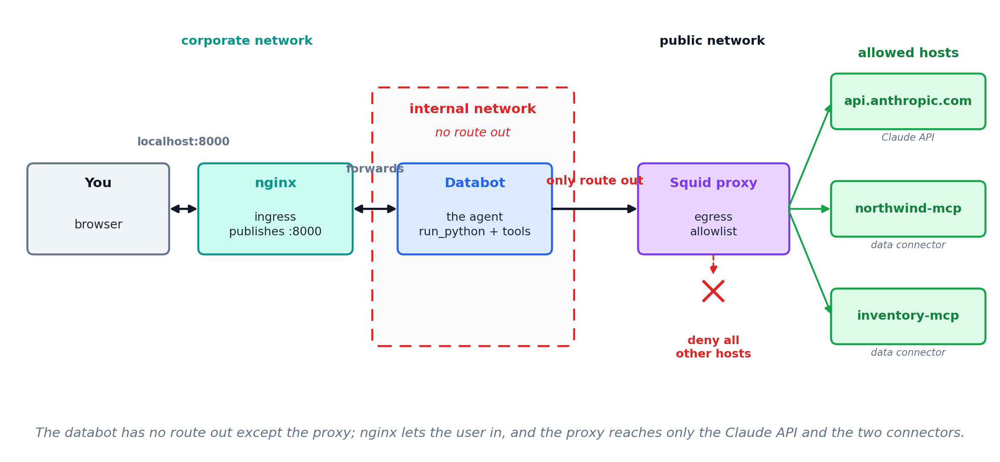

## This session

24. Multi-agent architectures
25. Security risks
26. Mitigating risks

# 24 · Multi-agent architectures

## Why more than one agent

::: {.cards .cards-3}
::: {.card}
[Separate context windows]{.card-title}

Each agent reads only its own material. The orchestrator gets the answer, not the material behind it.
:::

::: {.card .card-blue}
[One definition, many callers]{.card-title}

An agent's prompt, tools and examples are written once. Every orchestrator that needs that job done calls it instead of carrying its own copy of the instructions.
:::

::: {.card .card-sand}
[A smaller model per job]{.card-title}

Retrieval can run on a cheaper model than the one writing the answer.
:::
:::

::: {.note}
Mitigating security risks is another motivation.  We'll come back to that.
:::

## What else it changes

::: {.cards .cards-3}
::: {.card}
[A shorter tool list]{.card-title}

A model choosing among four tools picks better than the same model choosing among forty.
:::

::: {.card .card-blue}
[Work at the same time]{.card-title}

Two agents working on different parts of the question do not wait for each other.
:::

::: {.card .card-sand}
[Tested on its own]{.card-title}

You can rewrite one agent's prompt and test it without retesting the orchestrator.
:::
:::

## How they talk to each other {.divider}

## Giving the agent an API {.plain-title}

- Any chatbot is served by a backend.  Add an endpoint to it --- e.g., `chatbot.com/prompt` --- that receives a question, sends it to an LLM and returns the answer as plain text --- and any program that can fetch a URL can now use the chatbot.

- I added an endpoint (API) to a FRED agent, like we looked at earlier and launched it on my machine with uvicorn.

## Example: three-agent team

An example of a three-agent team:

::: {.cards .cards-3}
::: {.card}
[Orchestrator]{.card-title}

The one you chat with. Splits the question, then combines the two answers.
:::

::: {.card .card-blue}
[Data agent]{.card-title}

Reaches the data warehouse. Returns data and analysis.
:::

::: {.card .card-sand}
[Web agent]{.card-title}

Reaches the web. Returns information.
:::
:::

## How do we build this?

- Orchestrator is an agent with a chatbot interface and two tools: call_web_agent, and call_data_agent
- Data agent has tools for getting data and run_python for analysis.  It exposes an API.
- Web agent has web_fetch and web_search.  It exposes an API.

## Breakout exercise {.plain-title}

::: {.steps}
1. Create a FastAPI Northwind data agent connected to the MCP server `https://northwind-mcp.kerryback.com/mcp`.  It has an API and a run_python tool.
2.  Create a FastAPI web agent with web_search and web_fetch.  It has an API.
3.  Create a FastAPI orchestrator agent that has call_web_agent and call_data_agent tools.  It has a user interface with a prompt window.
:::

Work out the details with Claude. Tell Claude what you want and plan with it.

# 25 · Security risks

## Sending data to a provider {.divider}

## What happens to what you send

::: {.cards .cards-2}
::: {.card}
[It can be trained on]{.card-title}

With web search off, ask Claude what Apple's total revenue was in 2020. It answers from the weights, not from a lookup. What goes into a model can come back out of it.
:::

::: {.card .card-blue}
[It is retained]{.card-title}

Even where nobody trains on it, copies sit on the provider's disks for some window. A breach, a subpoena or an insider reaches them there, under somebody else's security.
:::
:::

::: {.note}
Apple's revenue is public. The mechanism is the point: the figure is in the weights, not on a page it fetched.
:::

## What regulations require

:::: {.columns}
::: {.column width="50%"}
[HIPAA]{.eyebrow}

Satisfactory assurances "must be documented through a written contract" meeting §164.504(e).

A Business Associates Agreement (BAA) is required. 45 CFR 164.502(e).
:::

::: {.column width="50%"}
[SEC Reg S-P]{.eyebrow}

Written policies "reasonably designed to require oversight, including through due diligence and monitoring, of service providers."

17 CFR 248.30.
:::
::::

## Letting it act {.divider}

## Prompt injection

::: {.lead}
The model cannot tell an instruction from a piece of content. Both arrive as text in the same conversation.
:::

Text placed where the agent will read it — an email, a document, a web page, a spreadsheet cell — is read in the same way as text you typed. An attacker needs no credentials, only a way to get words in front of the model.

::: {.note}
OWASP has ranked this first among risks to LLM applications since 2025.
:::

## EchoLeak {.plain-title}

[CVE-2025-32711 · Microsoft 365 Copilot · June 2025]{.eyebrow}

::: {.steps}
1. An attacker mails the victim a message containing instructions invisible to a human reader.
2. The victim asks Copilot to summarize their email. Copilot reads the hidden instructions.
3. Following them, Copilot places confidential data inside a URL in its response.
4. The victim's browser fetches that URL automatically.
5. The attacker reads the data out of their own server log.
:::

Zero clicks by the victim beyond the summary request.

## Three legs

::: {.cards .cards-3}
::: {.card}
[Private data]{.card-title}

Something worth taking: client records, financials, an inbox.
:::

::: {.card .card-blue}
[Untrusted content]{.card-title}

Text an outsider can control: a web page, an email, an uploaded file.
:::

::: {.card .card-sand}
[An outbound channel]{.card-title}

Any way for text to leave: fetching a URL, sending mail, writing somewhere shared.
:::
:::

All three in one agent is the condition. Remove any one and the attack does not work.

# 26 · Mitigating risks

## Training and retention: contractual solutions 

| | What it adds | Enough for |
|---|---|---|
| Opt out of training | a setting, revocable, data still retained briefly | personal, non-sensitive work |
| A signed data processing agreement | liability, breach notice, audit rights, a subprocessor list, zero retention on request | client data, regulated data |
| That, plus a business associate agreement | the same, covering protected health information | patient records |
| An enterprise agreement | service levels, support, single sign-on, indemnification, capacity | scale and operations |

## Data exfiltration: removing a leg

| Leg | How you remove it | What it costs |
|---|---|---|
| Private data | the agent sees only what you hand it — Cowork cannot reach outside its project folder | it cannot answer from data it never sees |
| Untrusted content | no web fetch, no reading files people upload, no general code execution | a narrow agent, and no `run_python` |
| A way out | an egress allowlist, and no tool that sends | results leave only when a person moves them |

Any of the three can go. Each takes capability with it, and which one you can afford to lose is the decision.

## A worked example {.divider}

## Three agents

::: {.cards .cards-3}
::: {.card}
[Orchestrator]{.card-title}

The one you chat with. Its only two tools are `web_chat` and `data_chat`. It holds no data and reaches nothing itself.
:::

::: {.card .card-blue}
[Webbot]{.card-title}

WebSearch and WebFetch, running at Anthropic. It reads untrusted content and holds no private data.
:::

::: {.card .card-sand}
[Databot]{.card-title}

`run_python` and the MCP data connectors, behind an egress proxy. It holds the private data and cannot reach the web.
:::
:::

## The architecture

{width=80% fig-align="center"}

## What each agent may be told {.compare}

:::: {.columns}
::: {.column width="50%"}
[`web_chat` is locked]{.eyebrow}

Its tool definition says it sends the user's verbatim prompt and nothing else. Nothing from the conversation, and so nothing from the data, can reach the agent that can reach the web.
:::

::: {.column width="50%"}
[`data_chat` is open]{.eyebrow}

The model composes this prompt from the conversation. That is safe only because databot has no route out.
:::
::::

The argument is about the arguments: what a tool accepts decides what can leave through it.

## Four containers, four networks

| | Networks | What that allows |
|---|---|---|
| Orchestrator | corporate, internalA, internalB | serves the chat UI, talks to both agents |
| Webbot | internalB, public | talks to the orchestrator, calls Anthropic |
| Databot | internalA | talks to the orchestrator and the proxy, nothing else |
| Squid proxy | internalA, public | the only route out of the data half |

::: {.note}
Webbot shares a network with the orchestrator, so the orchestrator's endpoints must authenticate at the application, not only at an external gateway.
:::

## Inside the data half

{width=88% fig-align="center"}

## Mechanical guards

::: {.cards .cards-2}
::: {.card}
[Sanitize the exit]{.card-title}

Even with the legs split, a delivered file could carry a planted remote image — the EchoLeak pattern. Every file the orchestrator hands back is checked first for anything that auto-fetches an external URL.
:::

::: {.card .card-blue}
[Safeguard memory]{.card-title}

Memory persists into every later conversation, so a planted instruction would reload forever. Every saved fact must be grounded in the user's own words, not in tool results or fetched content.
:::
:::

## Breakout exercise {.plain-title}

Go back to the orchestrator you built this morning and apply the architecture above to it.

::: {.steps}
1. Lock the web agent's tool definition so it can be handed the user's own words and nothing else.
2. Get a page in front of the web agent that tells it to ask for more than it was sent, and read what your orchestrator passed on.
3. Say which of the three legs you removed, and what the fix does not cover.
:::

::: {.note}
The model obeys the page every time. Whether that matters is a property of the architecture, not of the model.
:::
