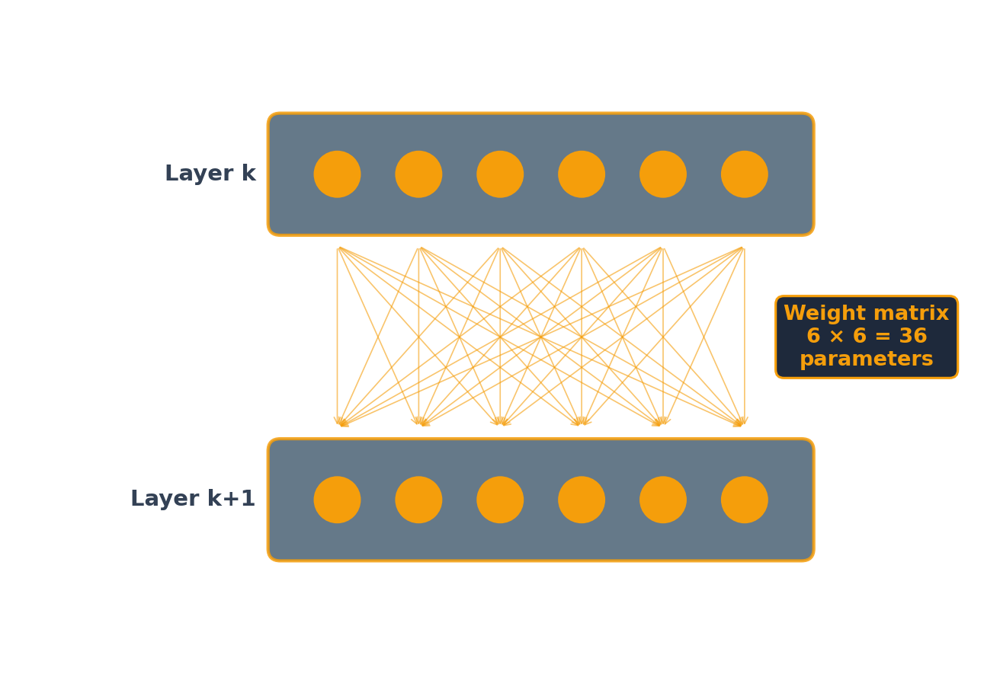
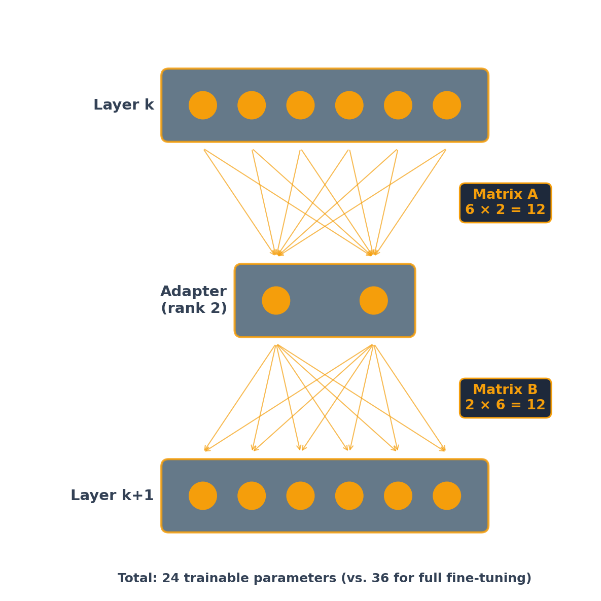

## This session

27. Inside a neural network
28. Training
29. Fine-tuning and LoRA

# 27 · Inside a neural network

## One neuron

::: {.lead}
Part 1 described a neural network as a function with parameters.
:::

A neuron weights the numbers coming into it, adds a bias, and passes the result through an activation function.

$$z = b + w_1 x_1 + w_2 x_2 \qquad\qquad h = f(z)$$

::: {.cards .cards-2}
::: {.card}
[Weights]{.card-title}

$w_1$ and $w_2$ set which inputs matter and how much. A negative weight subtracts.
:::

::: {.card .card-blue}
[Bias]{.card-title}

$b$ shifts the sum. With ReLU it sets how large the weighted inputs have to be before the neuron produces anything at all.
:::
:::

## Two activation functions {.compare .band-bottom}

:::: {.columns}
::: {.column width="50%"}
[Sigmoid]{.eyebrow}

$$\sigma(z) = \frac{1}{1 + e^{-z}}$$

Output between 0 and 1. Used on an output neuron when the answer is a probability.
:::

::: {.column width="50%"}
[ReLU]{.eyebrow}

$$\max(0,\, z)$$

Output 0, or the value itself. Used in hidden layers: cheaper, and the derivative does not shrink toward zero for large $z$.
:::
::::

## Why the activation is there

::: {.cards .cards-2}
::: {.card}
[Without it]{.card-title}

A weighted sum of weighted sums is another weighted sum. Stack a hundred linear layers and the whole network reduces to one linear function of the inputs.
:::

::: {.card .card-blue}
[With it]{.card-title}

Each layer bends the function. Depth then adds capacity instead of repeating what a single layer could already do.
:::
:::

## A small network {.band-bottom}

Two inputs, three neurons in a hidden layer, one output. Every input connects to every neuron in the next layer.

::: {.stats}
::: {.stat}
[9]{.stat-value}
[hidden layer: 3 biases and 3 × 2 weights]{.stat-label}
:::

::: {.stat}
[4]{.stat-value}
[output: 1 bias and 3 weights]{.stat-label}
:::

::: {.stat}
[13]{.stat-value}
[parameters to be chosen]{.stat-label}
:::
:::

## The forward pass {.plain-title}

```{=html}
<iframe src="forward-pass.html" style="width:100%; height:440px; border:0; background:transparent;" loading="eager" title="Forward pass through a small network"></iframe>
```

## The same pass in code {.plain-title}

```python
W1 = np.array([[0.5, 0.3], [-0.4, 0.6], [0.2, -0.3]])   # 3 neurons x 2 inputs
b1 = np.array([0.1, -0.2, 0.3])
W2 = np.array([0.7, -0.5, 0.8])
b2 = 0.2

x = np.array([1.2, -0.8])

h = sigmoid(W1 @ x + b1)      # hidden layer, 3 values
y = sigmoid(W2 @ h + b2)      # output, 1 value
```

::: {.note}
`W1 @ x` is a matrix-vector product: one row per neuron, one multiply-add per weight. That product is the operation GPUs are built for.
:::

## The same arithmetic at scale

::: {.stats}
::: {.stat}
[13]{.stat-value}
[parameters in the network above]{.stat-label}
:::

::: {.stat}
[1 billion]{.stat-value}
[Gemma 3 1B, which runs on a laptop]{.stat-label}
:::

::: {.stat}
[100s of billions]{.stat-value}
[a frontier model]{.stat-label}
:::
:::

::: {.note}
The arrangement differs: a transformer's layers include attention, from Part 1, rather than a plain fully connected stack. Every unit in it still takes a weighted sum, adds a bias, and applies an activation.
:::

# 28 · Training

## What training chooses

::: {.cards .cards-2}
::: {.card}
[Chosen by training]{.card-title}

Every weight and every bias. The 13 numbers above, or the hundreds of billions in a frontier model.
:::

::: {.card .card-blue}
[Chosen by hand, before training]{.card-title}

How many layers, how many neurons in each, which activation, how large a step to take.
:::
:::

## The loss {.plain-title}

Training needs one number to make smaller. For each example, compare what the network produced to the right answer.

| Task | Output layer | Loss |
|---|---|---|
| Predict a quantity | one neuron, no activation | squared error |
| Predict a label | one neuron, sigmoid | cross-entropy |
| Predict one of many labels | one neuron per label, softmax | cross-entropy |

::: {.note}
A language model is the third row, with one label per token in the vocabulary. Next-token prediction is a classification problem with about 100,000 classes.
:::

## Gradient descent {.band-bottom}

::: {.steps}
1. Run a batch of examples forward and compute the loss.
2. Find the derivative of the loss with respect to every parameter.
3. Move each parameter a small step against its derivative.
4. Repeat.
:::

::: {.note}
The size of that step is the learning rate. The notebook later in this session uses 2e-4.
:::

## Backpropagation

::: {.lead}
Step 2 is the one that needs an algorithm.
:::

::: {.cards .cards-2}
::: {.card}
[One parameter at a time]{.card-title}

Nudge a weight, run the whole network forward again, see how the loss moved. With a billion parameters that is a billion forward passes for one step.
:::

::: {.card .card-blue}
[Backpropagation]{.card-title}

Apply the chain rule from the loss backward through the layers. One backward pass yields the derivative for every parameter, at roughly the cost of one forward pass.
:::
:::

## Held-out data {.compare .band-bottom}

:::: {.columns}
::: {.column width="50%"}
[Training set]{.eyebrow}

The examples the parameters are fitted to. Loss here keeps falling for as long as you keep training.
:::

::: {.column width="50%"}
[Test set]{.eyebrow}

Examples held back and never fitted. Loss here stops falling, then rises, while training loss is still improving.
:::
::::

::: {.note}
With enough parameters a network can fit its training examples exactly and still do no better than chance on new ones.
:::

# 29 · Fine-tuning and LoRA

## Three ways to change what a model does {.plain-title}

| | What changes | Use when |
|---|---|---|
| Prompting | the text sent with the request | the model can do the job and needs telling |
| Retrieval | documents put into the context, from Part 6 | it needs facts it was not trained on |
| Fine-tuning | the weights | the behavior has to change: a format, a style, a judgment call |

::: {.note}
Fine-tuning does not add knowledge reliably.
:::

## When fine-tuning is worth it

::: {.cards .cards-3}
::: {.card}
[A fixed output format]{.card-title}

A label, a JSON record, a field in another system. Prompting gets the format most of the time.
:::

::: {.card .card-blue}
[Many examples, one narrow job]{.card-title}

Thousands of labeled cases already exist, and the job will run millions of times.
:::

::: {.card .card-sand}
[Cost per call]{.card-title}

A small fine-tuned model can match a large prompted one on one narrow task, at a fraction of the cost per call.
:::
:::

## Distillation {.band-bottom}

::: {.steps}
1. Run a frontier model on your inputs and keep its answers.
2. Treat those answers as labels.
3. Fine-tune a small open-weights model on them.
:::

::: {.note}
Part 6 covered where this runs into a provider's terms. Read them before doing it with a commercial model's output.
:::

## Full fine-tuning and LoRA

::: {.cards .cards-2}
::: {.card}
[Full fine-tuning]{.card-title}

Update every parameter. Needs GPU memory for the weights, their gradients and the optimizer state, and produces a complete copy of the model.
:::

::: {.card .card-blue}
[LoRA]{.card-title}

Freeze the original weights. Train two small matrices per layer instead. In the notebook later in this session, that is under 0.1% of the model's parameters.
:::
:::

::: {.note}
Hu et al., 2021: low-rank adaptation.
:::

## The weight matrix {.plain-title}

{width=50% fig-align="center"}

Six neurons feeding six neurons: 36 weights, one per connection. Full fine-tuning retrains all of them.

## The low-rank path {.plain-title}

{width=35% fig-align="center"}

The 36 frozen connections are not drawn. The trained path runs through two neurons: rank 2.

## LoRA: the arithmetic

$A$ compresses the input down to the rank and $B$ expands it back up, so the product $BA$ has the same shape as the original weight matrix $W$ and can be added to it:

$$W' = W + BA$$

::: {.note}
There is no activation function in the adapter path, which is why $BA$ is a matrix and the addition is possible. Once merged, the model has the architecture and the speed it had before.
:::

## At real scale {.band-bottom}

The six-by-six picture is a diagram. A transformer's layers are 4096 × 4096 and larger.

::: {.stats}
::: {.stat}
[16.8M]{.stat-value}
[parameters in one 4096 × 4096 layer]{.stat-label}
:::

::: {.stat}
[131K]{.stat-value}
[trained by a rank-16 adapter on it]{.stat-label}
:::

::: {.stat}
[128×]{.stat-value}
[fewer parameters to train]{.stat-label}
:::
:::

::: {.note}
The adapter is also what you store and ship: a file of megabytes, where full fine-tuning leaves you a second copy of the whole model.
:::

## QLoRA

::: {.cards .cards-2}
::: {.card}
[The base model, quantized]{.card-title}

Weights stored at 4 bits instead of 16. Gemma 3 1B goes from about 2 GB to about 800 MB.
:::

::: {.card .card-blue}
[Adapters on top of it]{.card-title}

The frozen weights are read at 4 bits; the small matrices train at full precision. A 70-billion-parameter model fits on one 48 GB GPU.
:::
:::

::: {.note}
Dettmers et al., 2023. This is what puts fine-tuning on a free Colab T4, which has 16 GB.
:::

## Hands-on: fine-tune Gemma 3 1B {.plain-title}

[Google Colab · free T4 GPU · about 15 minutes of training]{.eyebrow}

::: {.steps}
1. Load Gemma 3 1B at 4 bits.
2. Attach rank-16 adapters to the attention layers, `q_proj` and `v_proj` only.
3. Train on Financial PhraseBank: 2,264 news sentences that every annotator labeled the same way, positive, negative or neutral.
4. Run three test sentences through the model before and after.
:::

[Open the notebook in Colab](https://colab.research.google.com/github/kerryback/mgmt803/blob/main/files/part8/fine-tuning-gemma.ipynb)

::: {.note}
Needs a Hugging Face account, a read token, and Google's Gemma license accepted at [huggingface.co/google/gemma-3-1b-it](https://huggingface.co/google/gemma-3-1b-it).
:::

## Breakout exercise {.band-bottom}

::: {.steps}
1. Run the notebook as far as the baseline cell, and read what the base model says about the three test sentences.
2. Train, then compare the answers before and after.
3. The base model is about 2 GB and the saved adapter is 14 MB. Say what has to be on the serving machine for the fine-tuned model to answer, and what changes if you merge the adapter into the weights instead.
:::
