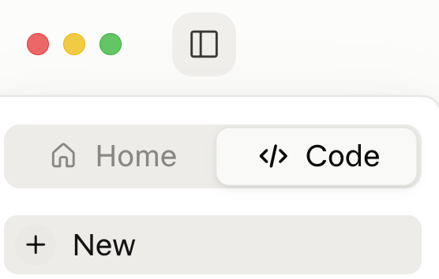
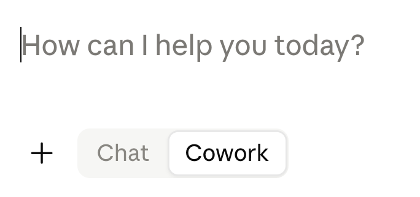
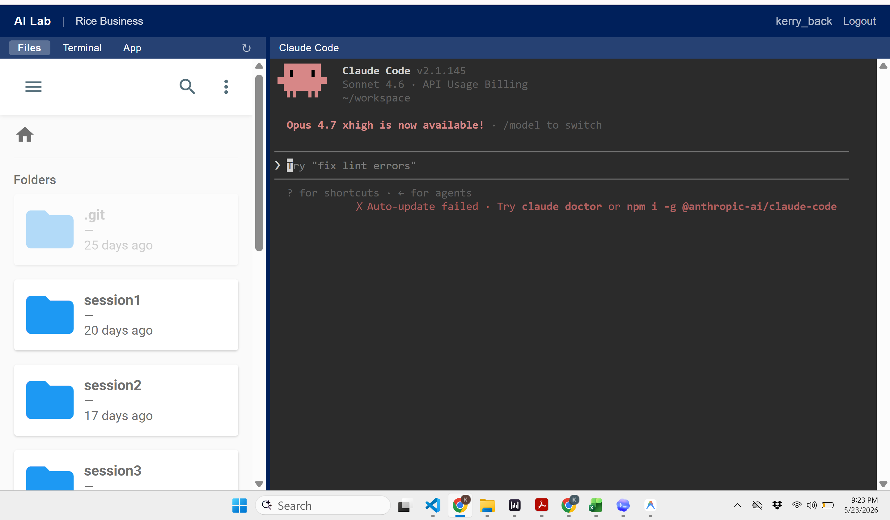

## Two Tracks

::: {.two-cards}
::: {.card-blue}
[Track 1: Install Software]{.card-title}

- Install an AI desktop application on your computer
- Install Python, Node.js, and Git
- Full control over your environment
:::
::: {.card-amber}
[Track 2: Use the AI Lab]{.card-title}

- Go to [lab803.kerryback.com](https://lab803.kerryback.com) in your browser
- Everything is pre-installed --- nothing to set up
- Claude Code terminal + file browser
:::
:::

::: {.notes}
There are two tracks you can follow in this course. Track 1 is to install software on your own computer. Track 2 is to use the Rice AI Lab, which is a remote server you access through your browser with everything pre-installed.
:::

## The Three Major Providers

::: {.info-box}
All three major AI providers offer similar desktop and CLI products, and any of them can be used for this course.

| Provider | Desktop App | CLI Agent |
|---|---|---|
| Anthropic (Claude) | **Claude Desktop** | Claude Code |
| OpenAI (ChatGPT) | **Codex Desktop** | Codex CLI |
| Google (Gemini) | **Google Antigravity 2.0** | Antigravity CLI |
:::

::: {.notes}
All three major AI providers --- Anthropic, OpenAI, and Google --- offer similar products, and any of them can be used for this course. For Claude, use Claude Desktop. For ChatGPT, use Codex Desktop along with Codex CLI. For Gemini, use Google Antigravity 2.0.
:::

## Two Modes

::: {.two-cards}
::: {.card-blue}
[Container / VM Mode]{.card-title}

- Runs code in a **sandboxed virtual machine or container** on your computer
- No additional software needed --- Python and other tools are built in
- Cannot access online data sources or remote services from code
- In Claude Desktop, this is called **Cowork**
:::
::: {.card-amber}
[CLI Mode]{.card-title}

- Runs code **directly on your machine**
- Requires installing **Python**, **Node.js**, and possibly **Git for Windows**
- Full access to the internet, databases, APIs, and local files
- In Claude Desktop, this is called **Code / Local**
:::
:::

::: {.notes}
Each of these products has two modes for running code. The first is a container or virtual machine mode. This runs code in a sandbox on your computer. No additional software is needed --- Python and other tools are built in. The tradeoff is that sandboxed code cannot access online data sources or remote services. In Claude Desktop, this mode is called Cowork.

The second is CLI mode, which runs code directly on your machine. This requires installing Python, Node.js, and possibly Git for Windows. The benefit is full access to the internet, databases, APIs, and your local files. In Claude Desktop, this mode is called Code, Local.
:::

## Claude Desktop

- Download and run the installer at [claude.com/download](https://claude.com/download)
- When you open it, it will ask to connect to your Anthropic account.
- The app splits in two --- [Home]{.accent} and [Code]{.accent} --- chosen at the top of the left sidebar (the square icon toggles the sidebar)

{width=35% fig-align="center"}

::: {.notes}
Claude Desktop is Anthropic's desktop application. Download and run the installer from claude.com/download. When you open it, it will ask you to connect to your Anthropic account.

The app splits in two at the top of the left sidebar: Home and Code. The square icon toggles the sidebar if you cannot find it. Home is the conversational side, the descendant of the web chat. Code is the descendant of the command-line tool, built for working directly in a folder of files. Knowing the split exists explains why the app can look completely different in two people's screenshots.
:::

## Four Modes of Claude Desktop

::: {.two-cards}
::: {.card-amber}
[Within Home, Chat or Cowork?]{.card-title}

Toggle in the prompt box

{width=95% fig-align="center"}
:::
::: {.card-teal}
[Within Code, Local or Cloud?]{.card-title}

Selector at the bottom of the window

{width=60% fig-align="center"}
:::
:::

::: {.notes}
Each half splits again, which is where the four modes come from. Inside Home, a toggle in the prompt box chooses Chat or Cowork. Inside Code, a selector at the bottom of the window may allow you to choose Local or Cloud --- whether the work happens on your machine or on Anthropic's, against a GitHub repository. Four modes, two toggles, and the toggles sit in different places, which is the genuinely confusing part.
:::

## What to Use?

- Chat is just an interface to claude.ai.  Everything works the same as the online chatbot.
- Cowork runs code in a virtual machine on your computer.  It can read, write, and edit your files.  It can install whatever Python libraries it needs.  It is the easiest way to get started.
- Code / Local runs code directly on your computer, using the code execution software you have installed.  Unlike Cowork (which is sandboxed), it can run web apps in your browser.
- Code / Cloud is GitHub integration, probably overkill.

::: {.footnote}
Cowork seems to be unreliable on Windows computers with ARM processors, like Microsoft Surface Pros.
:::

::: {.notes}
You can chat in any mode and execute code in any mode, so the choice is less consequential than it looks. Chat is just an interface to claude.ai --- everything works the same as the online chatbot. Cowork runs code in a virtual machine on your computer. It can read, write, and edit your files and install whatever Python libraries it needs. It is the easiest way to get started with an agent that writes and runs code. Code Local runs code directly on your computer using whatever software you have installed. Unlike Cowork, which is sandboxed, it can access online and remote data sources. Code Cloud is GitHub integration and is almost certainly overkill here.

Note that Cowork seems to be unreliable on Windows computers with ARM processors, like Microsoft Surface Pros.
:::

## Install Python

::: {.two-cards}
::: {.card-blue}
[Windows]{.card-title}

- Go to [**python.org/downloads**](https://www.python.org/downloads/) and click Download
- Run the installer --- [on the very first screen, check the box for **Add python.exe to PATH**]{.accent}
- To verify: open Command Prompt and type `python --version`
:::
::: {.card-amber}
[Mac]{.card-title}

- Install [**Homebrew**](https://brew.sh/) first (if you do not already have it)
- Then: `brew install python`
- To verify: type `python3 --version`
:::
:::

::: {.notes}
To use CLI mode --- Code mode in Claude Desktop, Codex CLI, or Antigravity CLI --- you need Python installed. On Windows, go to python.org/downloads and click Download. Run the installer, and on the very first screen, check the box that says Add python.exe to PATH --- this is important. On Mac, install Homebrew first if you do not already have it, then run brew install python. To verify the installation, open a terminal and type python --version or python3 --version.
:::

## Install Node.js

::: {.card-blue}
- It is also useful to install Node.js, which is an execution environment for JavaScript --- another programming language.
- Go to [**nodejs.org**](https://nodejs.org/) and download the LTS version (currently v22)
- Run the installer --- accept all defaults
- To verify: open a terminal and type `node --version`
- The command should return a version number
:::

::: {.notes}
It is also useful to install Node.js, which is an execution environment for JavaScript. Go to nodejs.org, download the LTS version --- currently v22 --- and run the installer with the default settings. To verify, open a terminal and type node --version. It should return a version number.
:::

## Install Git for Windows

::: {.info-box}
- Git is a version control system.  CLI agents use it to track changes to your files.
- Mac and Linux have Git pre-installed.  On Windows, you need to install it separately.
- Go to [**git-scm.com**](https://git-scm.com/) and click Download for Windows
- Run the installer --- accept all defaults
- To verify: open a terminal and type `git --version`
:::

::: {.notes}
Git is a version control system that CLI agents use to track changes to your files. Mac and Linux have Git pre-installed, but on Windows you need to install it separately. Go to git-scm.com, click Download for Windows, and run the installer with the default settings. To verify, open a terminal and type git --version.

Git for Windows also installs Git Bash, which provides a Unix-like terminal on Windows. CLI agents generally work better with Git Bash than with Command Prompt or PowerShell.
:::

## The AI Lab

::: {.info-box}
[How to Connect]{.box-title}

1. Open your browser and go to [**lab803.kerryback.com**](https://lab803.kerryback.com)
2. Your username is your netid and your password is your student ID beginning with S0.
3. You will see a split-pane workspace --- file browser on the left, Claude Code on the right.  There are options for the left pane (files, terminal, app).
:::

{width=50%}

## The AI Lab

::: {.two-cards}
::: {.card-blue}
[What You Get]{.card-title}

- Claude Code pre-installed and auto-launched
- Python, Node.js, skills, and browser tool already installed
- Pre-loaded course data and exercise files
- No subscription needed
- Nothing to install
:::

::: {.card-amber}
[How to Use It]{.card-title}

- Type prompts in Claude Code (right pane).  The prompt window is not mouse-enabled.  To edit a prompt, use the left and right arrow keys to move around and Backspace or Del to remove characters.
- Files appear in the file browser (left pane) after you click the Refresh button.  Right-click a file to download or use the menu.
:::
:::

::: {.notes}
The AI Lab is a Linux server with Claude Code pre-installed. Each of you gets your own account. You connect through your browser and you see a split-pane workspace. The left pane is a file browser showing your home directory and pre-loaded course data. The right pane is a terminal where Claude Code auto-launches when you connect.

You do not need a subscription to use the AI Lab. You do not need to install Python, Node.js, or any other software. Everything is ready.

When Claude Code creates files --- charts, Excel workbooks, Word documents --- they appear in the file browser. Right-click and select Download to save them to your computer.
:::
